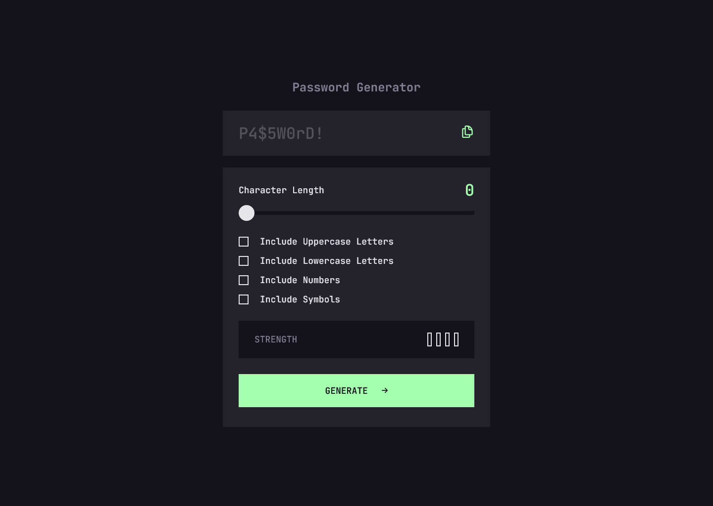

# Frontend Mentor - Password generator app solution

This is my solution to the [Password generator app challenge on Frontend Mentor](https://www.frontendmentor.io/challenges/password-generator-app-Mr8CLycqjh). Frontend Mentor challenges help you improve your coding skills by building realistic projects.

## Table of contents

- [Overview](#overview)
  - [The challenge](#the-challenge)
  - [Screenshot](#screenshot)
  - [Links](#links)
- [My process](#my-process)
  - [Built with](#built-with)
  - [What I learned](#what-i-learned)
  - [Continued development](#continued-development)
  - [Useful resources](#useful-resources)
- [Author](#author)

## Overview

### The challenge

Users should be able to:

- Generate a password based on the selected inclusion options
- Copy the generated password to the computer's clipboard
- See a strength rating for their generated password
- View the optimal layout for the interface depending on their device's screen size
- See hover and focus states for all interactive elements on the page

### Screenshot



### Links

- Solution URL: [My solution](https://www.frontendmentor.io/solutions/password-generator-with-css-and-js-UN8gmauoHH)
- Live Site URL: [Live site URL](https://password-generator-app-jiah.netlify.app/)

## My process

### Built with

- Semantic HTML5 markup
- CSS custom properties
- Flexbox
- Vanilla JavaScript

### What I learned

Throughout this project, I practiced my CSS and JavaScript skills by building a password generator. Here are some of the key things I learned:

#### How to Style the Range Input Across Browsers

Styling the input[type="range"] is tricky because different browsers render it differently by default. To make the styling consistent, I learned to use vendor-specific pseudo-elements like ::-webkit-slider-thumb for Chrome/Safari and ::-moz-range-thumb for Firefox.

Here's a simplified example of the cross-browser styling I implemented:

```css
input[type="range"]::-webkit-slider-runnable-track {
  background: var(--color-grey-900);
  height: 0.8rem;
}

input[type="range"]::-webkit-slider-thumb {
  -webkit-appearance: none;
  appearance: none;
  margin-top: -10px;
  background-color: var(--color-grey-200);
  height: 2.8rem;
  width: 2.8rem;
  border-radius: 50%;
  border: 2px solid transparent;
  transition: all 0.2s ease-in-out;
}

input[type="range"]::-moz-range-track {
  background: var(--color-grey-900);
  height: 0.8rem;
}

input[type="range"]::-moz-range-thumb {
  border: none;
  border-radius: 50%;
  background-color: var(--color-grey-200);
  height: 2.8rem;
  width: 2.8rem;
  border: 2px solid transparent;
  transition: all 0.2s ease-in-out;
}
```

#### Generating Passwords with JavaScript Based on User Selections

I used JavaScript to dynamically generate a password based on the user's selected options (uppercase, lowercase, numbers, and symbols). Here's how it works:

```js
function genPassword(length, upper, lower, num, symbol) {
  const lowerChars = "abcdefghijklmnopqrstuvwxyz";
  const upperChars = "ABCDEFGHIJKLMNOPQRSTUVWXYZ";
  const numChars = "0123456789";
  const specialChars = "!@#$%^&*()-_=+[]{}|;:,.<>?";

  let chars = "";
  if (upper) chars += upperChars;
  if (lower) chars += lowerChars;
  if (num) chars += numChars;
  if (symbol) chars += specialChars;

  let pass = "";
  for (let i = 0; i < length; i++) {
    const randIdx = Math.floor(Math.random() * chars.length);
    pass += chars[randIdx];
  }

  return pass;
}
```

#### Putting It All Together with the generate() Function

The generate() function handles the UI logic and ensures that:

- A default password is shown when no options are selected.

- A strong password is generated according to selected criteria.

- The password strength is evaluated and displayed visually.

```js
function generate() {
  const lengthValue = +rangeInput.value;

  const upper = upperLetter.checked;
  const lower = lowerLetter.checked;
  const num = number.checked;
  const sym = symbol.checked;

  if (lengthValue === 0 || (!upper && !lower && !num && !sym)) {
    passText.textContent = "P4$5W0rD!";
    passText.classList.remove("password-active");
    updateStrengthDisplay("");
    if (lengthValue === 0) lengthText.textContent = 0;
    return;
  }

  const pass = genPassword(lengthValue, upper, lower, num, sym);
  passText.textContent = pass;
  lengthText.textContent = lengthValue;
  passText.classList.add("password-active");

  const strength = calculateStrength(lengthValue, upper, lower, num, sym);
  updateStrengthDisplay(strength);
}
```

### Continued development

Although this project already taught me a lot, there's still one area I’d like to improve:
enforcing the generated password to meet the user's selected requirements more reliably.

In future versions, I want to ensure that if the user selects uppercase, lowercase, numbers, or symbols, the generated password will always include at least one character from each selected type. This will make the password both stronger and more user-accurate.

### Useful resources

- [Creating A Custom Range Input That Looks Consistent Across All Browsers](https://www.smashingmagazine.com/2021/12/create-custom-range-input-consistent-browsers/) - This is an amazing article which helped me finally style the range input.

- [Pure CSS Custom Checkbox Style](https://moderncss.dev/pure-css-custom-checkbox-style/) - This article helped me get custom checbox style like the Figma design

- [The filter(Boolean) Trick](https://michaeluloth.com/javascript-filter-boolean/) - This article helped me write calculateStrength function

- [How to copy text to user's clicpboard](https://web.dev/patterns/clipboard/copy-text)

## Author

- Frontend Mentor - [@JiaHe35354](https://www.frontendmentor.io/profile/JiaHe35354)
